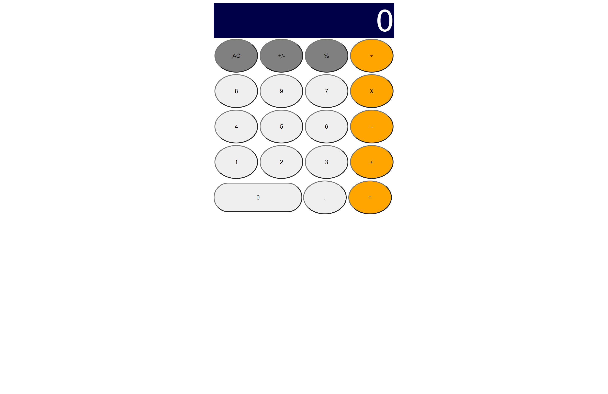

# React calculator App
This is a calculator app build with React

## Built With

- Javascript
- HTML
- CSS
- Node.js
- React
- React-DOM
- npm

## Live Demo

[Live Demo Link](https://threels-calculator.herokuapp.com/)

## Getting Started

To get a local copy up and running follow these simple example steps.

- Git clone https://github.com/mikethreels/react_calculator
- Move to the root directory in your command line
- run `npm install`
- run `npm start`

### Usage

The application works like a normal calculator it includes below calulation possibilities.
- multiply
- divide
- add
- subtract

## Author
👤 Michael Threels
- Github: [@mikethreels](https://github.com/mikethreels)
- Twitter: [@MichaelThreels](https://twitter.com/MichaelThreels)
- LinkedIn: [michaelthreels](https://www.linkedin.com/in/michael-threels)

## 🤝 Contributing

Contributions, issues and feature requests are welcome!

Feel free to check the [issues page](issues/).

## Show your support

Give a ⭐️ if you like this project!
